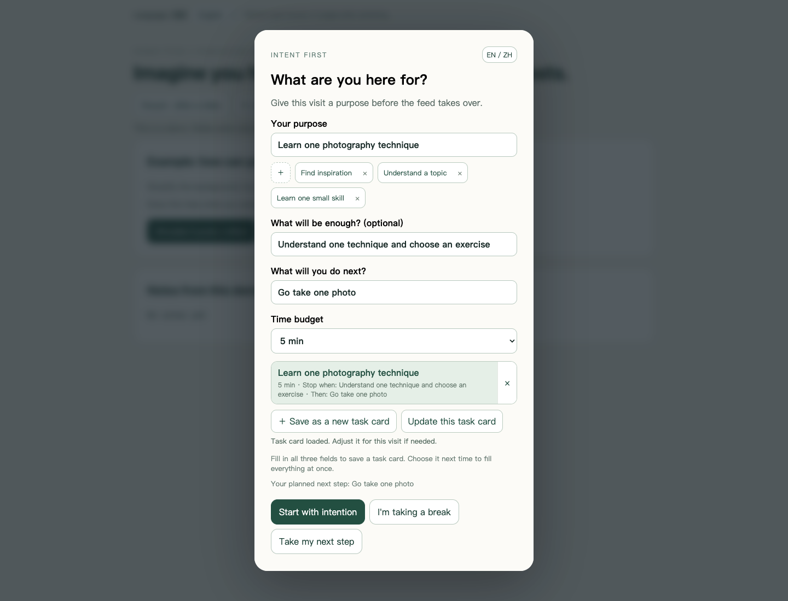
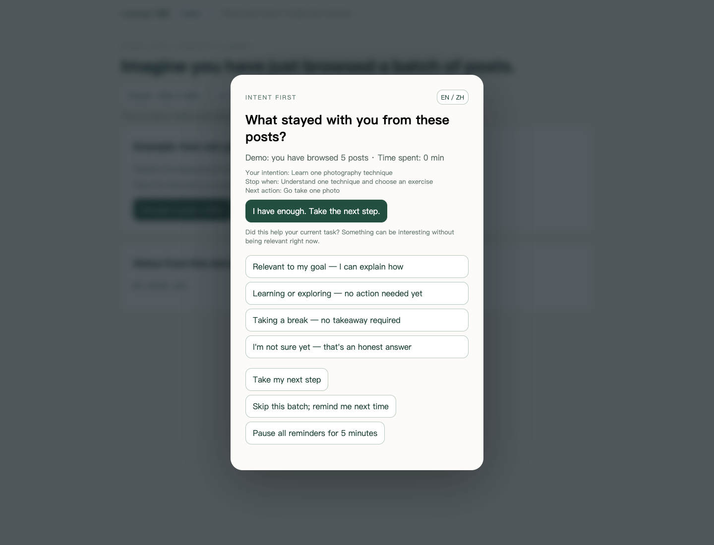

# Intent First · 醒一下

**带着目的打开，用自己的话想一想，带着下一步离开。**

**[⬇ 下载 Chrome 安装包](https://github.com/chenfandanfangfarendechuxian-ctrl/intent-first/releases/latest/download/intent-first-chrome.zip)** · [查看安装步骤](#安装与演示)

不需要懂代码，也不需要安装开发工具。同一个安装包包含中文和英文。

[English](README.md) · [为什么做这个插件](docs/why-intent-first.zh-CN.md) · [隐私说明](PRIVACY.md) · [验证记录](VALIDATION.md)

"醒一下"是一个用于 **X / Twitter 和抖音网页版**的 Chrome 扩展。它在无限信息流里加一个停顿：提醒你这次为什么来，刚才真正留下了什么，以及接下来要做什么。

界面支持**英文和中文**，默认英文，可以在扩展面板、设置页或演示页切换。切换后，请刷新已经打开的抖音和 X 页面。

> "这个内容可能有用"，不等于"它帮助了我这次要做的事"。



## 安装与演示

目前是早期的本地加载版本，**尚未上架 Chrome 应用商店**。

1. **[点击下载 `intent-first-chrome.zip`](https://github.com/chenfandanfangfarendechuxian-ctrl/intent-first/releases/latest/download/intent-first-chrome.zip)**。这是专门的安装包，不用在源码列表里找文件。
2. **解压 ZIP。** 将解压后的 **`intent-first` 文件夹**放在固定位置，例如“文稿 / Documents”。Chrome 会从这里加载插件，安装后请保留这个文件夹。
3. 把 **`chrome://extensions`** 复制到 Chrome 地址栏，按回车。
4. 打开右上角的**“开发者模式”**，点击**“加载已解压的扩展程序”**（部分版本叫“加载未打包的扩展程序”）。
5. 选择**里面直接有 `manifest.json` 的 `intent-first` 文件夹**。选择整个文件夹，不是 ZIP，也不是里面的某个文件。
6. 点击 Chrome 右上角的拼图图标 → **Intent First** → **Notes & settings / 我的记录与设置**，选择中文或英文。最后刷新已经打开的抖音和 X 页面。

你应该选择的文件夹长这样：

```text
intent-first/           ← 在 Chrome 中选择这个文件夹
├── manifest.json
├── content.bundle.js
├── popup.html
└── ...
```

**下载哪个？** 就下载上面链接的 **`intent-first-chrome.zip`**。GitHub 的 **Source code (zip)**、**Source code (tar.gz)** 和 **Code → Download ZIP** 是完整开发项目。如果已经下载了完整项目，则选择其中的 **`extension` 文件夹**。

**提示“清单文件缺失或不可读取”？** 先解压，再打开你选中的文件夹，确认里面直接有 `manifest.json`；如果里面还套着一层文件夹，就再进入一层。

想先体验流程，可以打开安装文件夹里的 `demo.html`；演示使用虚构内容和临时记录，不写入真实笔记。

**更新已有插件：** 将新文件放回原安装文件夹，在 `chrome://extensions` 找到 Intent First，点“重新加载”，再刷新抖音、X 页面。刷新前先复制尚未保存的内容。

## 怎么使用

**打开前：定目的。** 写下这次要找什么，选择 5、10 或 20 分钟预算。常用场景可以保存为任务卡：

- 目的：学一个摄影技巧。
- 结束条件：看懂一种方法，选好一个练习。
- 退出后行动：出去拍一张照片。
- 时间预算：5 分钟。

下次点一次卡片，就能填入全部内容。也可以明确选择"我就是休息一下"。

**刷到一个节点：停一下。** X 每浏览 5、10 或 15 条推文提醒一次；抖音在视频接近结束或切换下一条时提醒。另有定时补充提醒。计数代表内容进入阅读区域，不代表实际看懂。

**停下来：做一次真实判断。** 选择与自己的目标相关、探索学习、娱乐休息，或者暂时没想清楚。目标相关需要自己写一句收获、对应目标和一小步行动，例如做一道题、核对一个来源或练一次新技巧。目标、目的、行动支持自定义预设，自己的理解仍由自己填写。



**最后：决定继续还是行动。** "只跳过这次"不会关闭下一次提醒；"暂停所有提醒 5 分钟"会明确暂停提醒和推文计数。

如果这次**填了结束条件**，复盘界面还会出现"目标已达到，去做下一步"，点它进入该任务指定的行动和 10 分钟专注计时页。结束条件是选填的，留空时这个入口不会出现。

它是自愿使用的提醒工具，不是强制封锁软件。

## 适合谁

为一道题找解释的学生、想练一个新技巧的人、追踪新闻的读者、规划周末出行的人，或者想主动休息一会儿的任何人。只要你有过"本来想做一件事，后来却一直刷"的经历，就能理解这个工具想帮什么忙。

## 为什么做它

我有时想了解一条新闻、找一个教程，或者只是休息一会儿。后来却一直刷着，渐渐忘了最初为什么打开。有时确实在学，有时只是用这个说法让自己继续刷。

我想要一个简单的工具，让我及时发现两者的区别。学习、工作、兴趣探索和主动休息都可以，它不要求每次浏览都产出成果。[完整的想法写在这里。](docs/why-intent-first.zh-CN.md)

## 记录和 AI

记录可标记"已实践"，可导出 JSON，也可导出"笔记＋整理提示词"，由你决定是否交给 AI 归纳和质疑。

目前**没有连接 AI API、自动总结、完整视频转录或自动发布功能**。导出文件不会自动发送数据。

## 隐私与边界

- 无账号、广告、埋点或开发者服务器；数据保存在当前浏览器的扩展本地存储。
- 权限为 `storage`，内容脚本只匹配抖音、X、Twitter 域名。
- 记录可能包含标题、链接、自己的笔记、任务信息及可读取的推文文本；不获取完整视频。
- 无云同步，卸载前请先导出需要保留的数据。
- 网站改版、快速滚动、特殊播放器可能影响检测，不能保证每次准确提醒。
- 各标签页分别计时；时间和计数不代表真实注意力、理解程度或生产力。
- 结束条件由你自己判断。它不会用 AI 判定你是否"认真"。

详细说明见[隐私文档](PRIVACY.md)。

英文界面不意味着支持 TikTok、YouTube、Instagram 或手机 App；目前支持的是 **X / Twitter 和抖音网站**。

这是一个帮助自己有意识浏览的实践项目，没有经过证明能改善生产力或心理健康的对照实验。

## 开发

源码用中文书写，构建时按 `locales/en.json` 生成中英双语包。技术说明、开发命令和测试范围见 [英文 README](README.md#development) 与 [验证记录](VALIDATION.md)。配图使用示例数据。

两条给贡献者的约定：新增中文界面文案要在同一次提交里补进 `locales/en.json`，否则构建会失败；分类、来源和已隐藏的默认预设等标识使用稳定编码，展示时才本地化。用户填写的笔记和任务文字保持原样；已有记录及保存的提醒原因不会随语言切换自动翻译。

## 许可

[MIT](LICENSE)。
